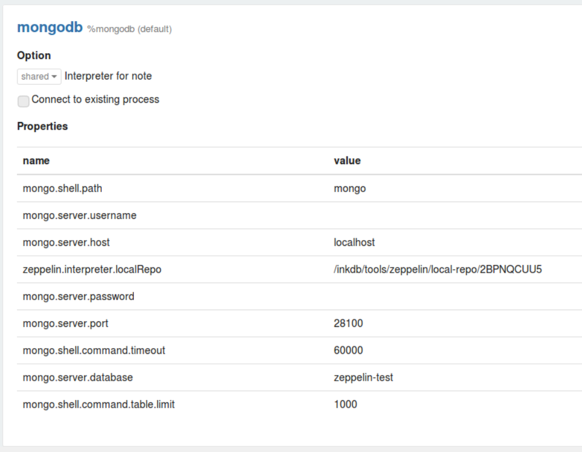
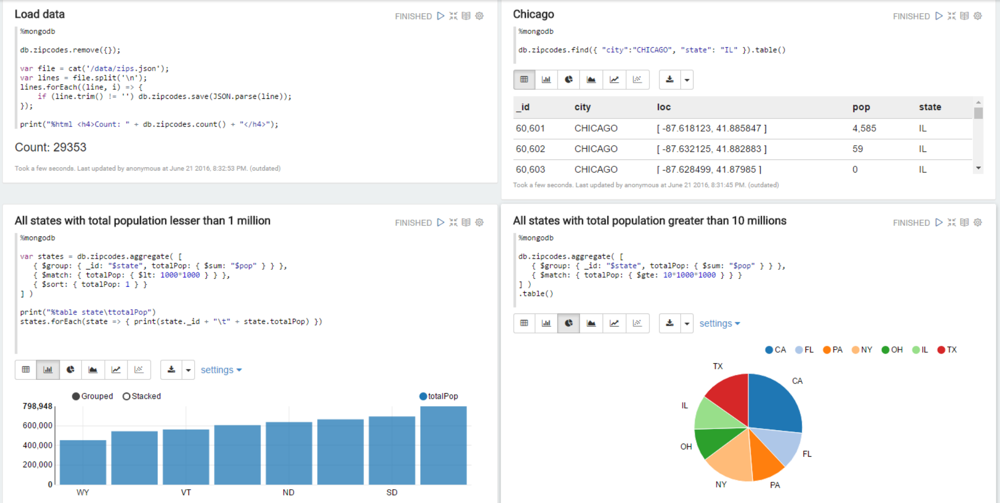

# zeppelin-mongodb-interpreter
MongoDB interpreter for Apache Zeppelin.
Support versions of MongoDB: >= 3.0

## Build

Requirement: Zeppelin must be in your local repo.

```sh
mvn clean package
```

## Download

If you cannot build the jar, you can download it in the [release page](https://github.com/bbonnin/zeppelin-mongodb-interpreter/releases)

## Deployment

* Update `$ZEPPELIN_HOME/conf/zeppeln-site.xml`
```xml
<property>
  <name>zeppelin.interpreters</name>
  <value>...,org.apache.zeppelin.mongodb.MongoDbInterpreter</value>
</property>
```
* Create `$ZEPPELIN_HOME/interpreter/mongodb`
* Copy interpreter jar in `$ZEPPELIN_HOME/interpreter/mongodb`


## Configuration

<table>
  <tr><th>Parameter</th><th>Default value</th><th>Description</th></tr>
  <tr><td>mongo.shell.path</td><td>mongo</td><td>Mongo shell path</td></tr>
  <tr><td>mongo.shell.command.timeout</td><td>60000</td><td>Mongo command timeout</td></tr>
  <tr><td>mongo.shell.command.table.limit</td><td>1000</td><td>Limit of documents displayed in a table</td></tr>
  <tr><td>mongo.server.database</td><td>test</td><td>MongDB database name</td></tr>
  <tr><td>mongo.server.host</td><td>localhost</td><td>Host of the MongDB server</td></tr>
  <tr><td>mongo.server.port</td><td>27017</td><td>Port of the MongDB server</td></tr>
  <tr><td>mongo.server.username</td><td></td><td>Username for authentication</td></tr>
  <tr><td>mongo.server.password</td><td></td><td>Password for authentication</td></tr>
</table>

## How to use

In Zeppelin, use `%mongodb` in a paragraph.
After that, you can type the same Javascript code you use when you write scripts for the Mongo shell.
For more information, please consult: https://docs.mongodb.com/manual/tutorial/write-scripts-for-the-mongo-shell/

There are several functions that have been added to help you in Zeppelin:
* printTable(cursor, fields, flattenArray): to print a table (i.e. it uses `%table`). Arguments:
  * cursor: a DBQuery or DBCommandCursor instance
  * fields: an array of field names to put in the table (can be null)
  * flattenArray: if true, the arrays in the documents will also be flatten (false by default)
* DBQuery.prototype.table: to print a table (it invokes the previous function)
* DBCommandCursor.prototype.table: same as above

Examples:
```javascript
%mongodb

// Display a table
db.zipcodes.find({ "city":"CHICAGO", "state": "IL" }).table()
```

```javascript
%mongodb

var states = db.zipcodes.aggregate( [
   { $group: { _id: "$state", totalPop: { $sum: "$pop" } } },
   { $match: { totalPop: { $lt: 1000*1000 } } },
   { $sort: { totalPop: 1 } }
] )

// Build a 'table'
print("%table state\ttotalPop")
states.forEach(state => { print(state._id + "\t" + state.totalPop) })
```


## Examples

* Configuration:


* Queries (these examples come from: https://docs.mongodb.com/manual/tutorial/aggregation-zip-code-data-set/)



